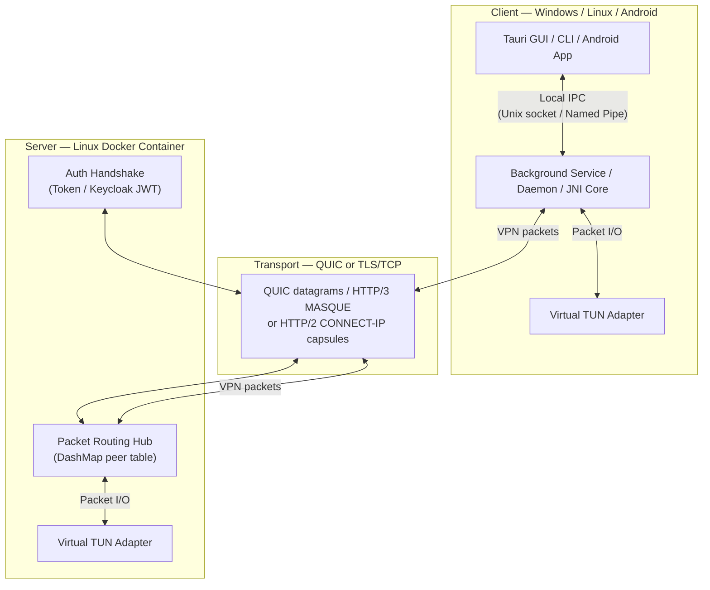

<p align="center">
  
</p>

<h1 align="center">Mavi VPN</h1>

<p align="center">
  <strong>High-performance, censorship-resistant VPN built with Rust</strong>
</p>

<p align="center">
  <a href="#-quick-start"></a>
  <a href="https://github.com/zerox80/mavi-vpn/actions"></a>
  <a href="https://github.com/zerox80/mavi-vpn/actions"></a>
  <a href="LICENSE"></a>
  
</p>


---
> ⚠️ Mavi VPN is early beta software and has not been independently audited. Do not rely on it for high-risk security use cases yet.

Mavi VPN tunnels all network traffic over **QUIC** by default, with an optional
**HTTP/2 CONNECT-IP** transport over TLS/TCP. The QUIC path uses the
[`quinn`](https://github.com/zerox80/quinn) and [`h3`](https://github.com/zerox80/h3)
forks, both tracked on `main`, to deliver secure, low-latency connectivity even
on unstable mobile networks. The HTTP/2 path uses the branch-tracked
[`h2`](https://github.com/zerox80/h2) fork on `master`. A scheduled CI workflow
tests and advances `Cargo.lock` to the latest fork commits every day. It supports
**Windows**, **Linux**, and **Android** with native clients and an optional
cross-platform **Tauri GUI**.

## Key Features

| Category | Feature | Details |
|---|---|---|
| **Censorship Resistance** | Layer 7 Obfuscation | VPN traffic can masquerade as **HTTP/3** via ALPN `h3` |
| | Probe Resistance | Unauthorized connections receive a fake **nginx** welcome page (H3 200 OK) |
| | MASQUE / RFC 9484 | Optional `connect-ip` capsule framing for DPI-proof wire format |
| | HTTP/2 CONNECT-IP | Optional TLS/TCP transport using Extended CONNECT and RFC 9297 capsules |
| | Encrypted Client Hello | **ECH GREASE** + SNI spoofing via X25519/HPKE (RFC 9180) |
| | Certificate Pinning | SHA-256 cert fingerprint verification on all clients |
| **Performance** | Zero-Copy Path | `bytes`/`BytesMut` across the entire packet pipeline |
| | BBR Congestion Control | Optimized for high-bandwidth, high-latency mobile networks |
| | GSO/GRO | Generic Segmentation Offload to reduce syscall overhead |
| | 4 MB UDP Buffers | Auto-tuned OS-level socket buffers for burst resilience |
| | mimalloc | High-performance memory allocator on the server |
| **Mobile-First** | Seamless Roaming | QUIC connection migration — no handshake restart on IP change |
| | MTU Coupling (1280..1360) | QUIC payload is derived as TUN MTU + 80; ICMP PTB generation (RFC 4443) |
| | Split Tunneling | Per-app policies on Android; destination include/exclude policies on Linux and Windows |
| **Auth** | Static Token | Simple pre-shared key authentication |
| | Keycloak OIDC | Enterprise SSO with JWT validation, PKCE, and JWKS rotation |
| **Network** | Dual-Stack | Full IPv4 + IPv6 support (NAT66 via ip6tables) |
| | DNS Isolation | NRPT rules on Windows; per-tunnel DNS on Linux/Android |

## Architecture



## Project Structure

```
mavi-vpn/
├── backend/            # Linux VPN server (Rust) — QUIC endpoint, IP pool, routing, Keycloak
│   ├── src/
│   │   ├── main.rs           # Entry point, connection accept loop
│   │   ├── config/            # CLI/env config (clap)
│   │   ├── state/             # AppState: IP pool (v4+v6), peer DashMap
│   │   ├── routing.rs        # TUN reader/writer tasks with local peer cache
│   │   ├── cert.rs           # TLS cert generation & SHA-256 PIN export
│   │   ├── ech.rs            # ECH key generation & ECHConfigList persistence
│   │   ├── keycloak.rs       # OIDC JWT validator with JWKS refresh
│   │   ├── handlers/         # Per-connection QUIC/HTTP2 session handlers
│   │   ├── network/          # TUN device creation, h3-quinn adapter
│   │   └── server/           # QUIC and HTTP/2 listeners
│   ├── docker-compose.yml    # Full stack: VPN + optional Traefik + Keycloak
│   ├── entrypoint.sh         # iptables NAT, IPv6 forwarding, MSS clamping
│   └── .env.example          # All configuration variables documented
│
├── windows/            # Windows client (Rust) — WinTUN, Service/Client IPC
│   └── src/
│       ├── main.rs           # CLI client (start/stop/status)
│       ├── bin/service.rs    # Windows Service (WinTUN, routing, NRPT DNS)
│       ├── vpn_core.rs       # QUIC/HTTP2 tunnel logic, ECH, MASQUE framing
│       └── oauth.rs          # PKCE OAuth2 flow for Keycloak
│
├── linux/              # Linux client (Rust) — TUN via /dev/net/tun, systemd
│   └── src/
│       ├── main.rs           # CLI + daemon mode + IPC client
│       ├── vpn_core.rs       # QUIC/HTTP2 tunnel logic with network change detection
│       ├── daemon/           # Unix socket IPC server for GUI/CLI integration
│       ├── network.rs        # Route setup, DNS config, cleanup
│       └── tun.rs            # Raw TUN device via ioctl
│
├── android/            # Android app (Kotlin + Rust JNI)
│   └── app/src/main/
│       ├── kotlin/           # Jetpack Compose UI, VpnService, NetworkCallback
│       └── rust/src/lib.rs   # JNI core: QUIC/HTTP2, cert pinning, migration
│
├── gui/                # Cross-platform Tauri v2 GUI (HTML/CSS/JS + Rust)
│   ├── src/                  # Frontend (vanilla HTML/CSS/JS)
│   └── src-tauri/            # Tauri backend (IPC bridge, system tray, WiX installer)
│
├── shared/             # Shared library (Rust)
│   └── src/
│       ├── lib.rs            # ControlMessage protocol (Auth → Config → Datagrams)
│       ├── icmp.rs           # ICMP "Packet Too Big" generation (RFC 792/4443)
│       ├── ipc.rs            # IPC protocol (SecureIpcRequest, Config, Response)
│       ├── masque.rs         # CONNECT-IP capsules, varints, datagram framing
│       └── hex.rs            # Hex encode/decode utilities
│
├── quic-tester/        # DPI probe simulator — verifies censorship resistance
├── docs/               # INSTALLATION.md, NGINX_PROXY.md, whitepaper.tex
├── Dockerfile          # Multi-stage build (rust:1.95 → debian:trixie-slim)
└── .github/workflows/  # CI: build (Linux CLI, Android APK, Linux/Windows GUI), tests
```

## Quick Start

### Server Deployment (Docker)

```bash
cd backend
cp .env.example .env
nano .env                    # Set VPN_AUTH_TOKEN and optionally VPN_PORT
docker compose up -d --build
```

To force-refresh the forked Rust Git dependencies during deployment:
```bash
docker compose pull --ignore-buildable
docker compose build --pull --no-cache vpn-server
docker compose up -d --force-recreate
```

Retrieve the certificate PIN for clients:
```bash
cat data/cert_pin.txt
```

> **Ports:** The Compose default is UDP `10443` for QUIC. If HTTP/2 is enabled,
> also allow the TCP port configured by `VPN_HTTP2_BIND_ADDR` (it may use the
> same numeric port as the QUIC listener).

### Windows Client

**Automated (recommended):**
```powershell
# Run PowerShell as Administrator
python install_cli_windows.py      # Installs CLI + Windows Service
python install_gui_windows.py      # Installs Tauri GUI (optional)
```

**Usage:**
```powershell
mavi-vpn-client start     # Connect (prompts for config on first run)
mavi-vpn-client stop      # Disconnect
mavi-vpn-client status    # Check connection status
```

### Linux Client

**Automated (recommended):**
```bash
python3 install_cli_linux.py       # Installs CLI + optional systemd service
python3 install_gui_linux.py       # Installs Tauri GUI (deb/rpm/AppImage)
```

The CLI installer creates the `mavivpn` group and adds your desktop user so the GUI/CLI can control the root daemon after you log out and back in.

**Usage:**
```bash
sudo mavi-vpn                      # Interactive connect (direct mode)
sudo mavi-vpn daemon &             # Start IPC daemon (for GUI)
mavi-vpn start                     # Connect via daemon
mavi-vpn stop                      # Disconnect
mavi-vpn status                    # Check VPN status
```

### Android Client

1. Install **Rust** targets + `cargo-ndk`:
   ```bash
   cargo install cargo-ndk
   rustup target add aarch64-linux-android armv7-linux-androideabi x86_64-linux-android
   ```
2. Open the `android/` folder in **Android Studio**
3. Build → Build APK — the Rust core compiles automatically via Gradle

### Tauri GUI (Cross-Platform)

```bash
cd gui
npm install
npm run tauri -- dev       # Development
npm run tauri -- build     # Production (generates MSI/DEB/RPM)
```

## Censorship Resistance Modes

Mavi VPN offers several mutually exclusive transport modes:

| Level | Mode | Wire Format | Activate |
|---|---|---|---|
| **0** | Standard | Raw QUIC datagrams | Default |
| **1** | CR Mode | QUIC + ALPN `h3` + probe resistance | `censorship_resistant: true` |
| **2A** | HTTP/3 Framing | MASQUE connect-ip (RFC 9484) over QUIC | `http3_framing: true` |
| **2B** | HTTP/2 CONNECT-IP | TLS/TCP + ALPN `h2` + RFC 8441 Extended CONNECT + RFC 9297 capsules | `http2_framing: true` |
| **+** | ECH | SNI spoofing + HPKE GREASE (RFC 9180) | Provide `ech_config` hex |

HTTP/2 mode requires `VPN_HTTP2_BIND_ADDR=0.0.0.0:10443` (or another TCP port) on the server and the **HTTP/2 CONNECT-IP** option on the client. It is mutually exclusive with CR mode, HTTP/3 framing, and ECH. The server and clients exchange real HTTP/2 frames and CONNECT-IP capsules. Unlike the QUIC data plane, HTTP/2 capsules are reliable and ordered because they run over TLS/TCP; traffic volume and timing can still differ from ordinary browsing.

When CR Mode is enabled, the server responds to unauthorized connections with a fabricated HTTP/3 nginx welcome page, improving resistance to simple active probes.

**ECH** is supported on QUIC clients via `EchMode::Grease` — the real SNI is hidden behind a cover domain (e.g. `cloudflare-ech.com`). The server persists the binary ECH config/key files and writes the administrator-facing hex config to `data/ech_config_hex.txt`. HTTP/2 mode does not use ECH.

## Authentication

### Static Token
Set `VPN_AUTH_TOKEN` on the server. Raw QUIC clients send it in the bincode
control handshake; HTTP/3 and HTTP/2 clients send it as `Authorization: Bearer
<token>` during CONNECT-IP setup.

### Keycloak OIDC (Enterprise)
Full enterprise SSO with Keycloak:

1. Enable in server `.env`:
   ```bash
   VPN_KEYCLOAK_ENABLED=true
   VPN_KEYCLOAK_URL=https://auth.example.com
   VPN_KEYCLOAK_REALM=mavi-vpn
   VPN_KEYCLOAK_CLIENT_ID=mavi-client
   ```
2. Deploy Keycloak via the included `docker-compose`:
   ```bash
   COMPOSE_FILE=docker-compose.yml:keycloak/docker-compose.yml
   COMPOSE_PROFILES=traefik,keycloak
   ```
3. On first start, Keycloak **auto-imports** the `mavi-vpn` realm from `backend/keycloak/mavi-vpn-realm.json` — including the `mavi-client` public PKCE client, the `vpn-user` realm role, and token lifespans tuned for the VPN refresh cycle (10 min access token, 1 h SSO idle, 24 h SSO max). You only need to create your users in the Keycloak admin console; the realm and client setup is automated. See `docs/INSTALLATION.md` Step 4 for details.
4. Clients authenticate via **browser-based PKCE OAuth2** — the CLI/GUI opens a local HTTP server on port `18923`, redirects to Keycloak, and captures the JWT automatically.
5. Android release builds must use a verified HTTPS App Link redirect. Build with `-Pmavi.oauthRedirectUri=https://<verified-domain>/<callback-path>`, register that exact URI in Keycloak, and host `/.well-known/assetlinks.json` for the `com.mavi.vpn` package. Debug builds use `com.mavi.vpn://oauth/callback` by default.

> The server validates JWTs using Keycloak's JWKS endpoint with automatic key rotation and constant-time `azp` comparison.

## Performance Tuning

| Setting | Value | Why |
|---|---|---|
| Inner TUN MTU | **1280** | IPv6 minimum — universally supported, avoids fragmentation |
| QUIC Payload | **TUN MTU + 80** | Derived from the selected inner MTU; default is 1360 |
| Congestion Control | **BBR** | Bandwidth-based, not loss-based — optimal for mobile/high-latency |
| UDP Socket Buffers | **4 MB** | Prevents kernel drops during GSO bursts |
| Allocator | **system default** | Avoids an unused native allocator dependency in test and build paths |
| Release Profile | `lto=true, codegen-units=1, strip=true` | Maximally optimized binary |

## Configuration Reference

### Desktop split tunneling

Linux and Windows connections support destination-based split tunneling in the
CLI and Tauri GUI. Set `split_tunnel_mode` to `include` to send only selected
destinations through the VPN, or `exclude` to send selected destinations over
the physical connection while the rest uses the VPN. `split_tunnel_targets`
accepts domains, IP addresses, and CIDR prefixes, for example:

```json
{
  "split_tunnel_mode": "exclude",
  "split_tunnel_targets": ["updates.example.com", "10.20.0.0/16"]
}
```

Domains are resolved once through the physical DNS resolver before tunnel
routes are installed. Their routes therefore stay fixed until the next
connection. In `include` mode the desktop keeps physical DNS active so only
the resolved destinations enter the VPN. Android continues to use its native
package-based per-app policy.

### Server settings

All server settings can be configured via environment variables or CLI flags:

| Variable | Default | Description |
|---|---|---|
| `VPN_BIND_ADDR` | `0.0.0.0:4433` | QUIC listen address |
| `VPN_HTTP2_BIND_ADDR` | *(disabled)* | Optional TLS/TCP listener for HTTP/2 CONNECT-IP; may use the same numeric port as QUIC |
| `VPN_AUTH_TOKEN` | *(required)* | Pre-shared authentication token |
| `VPN_NETWORK` | `10.8.0.0/24` | IPv4 client subnet (supports /8 to /30) |
| `VPN_NETWORK_V6` | `fd00::/64` | IPv6 client subnet (ULA) |
| `VPN_DISABLE_IPV6` | `false` | Skip all IPv6 setup and run IPv4-only |
| `VPN_IPV6_WAIT` | `30` | Seconds to wait for the WAN's global IPv6 to appear before continuing |
| `VPN_DNS` | `1.1.1.1` | DNS server pushed to clients |
| `VPN_DNS_V6` | *(automatic)* | IPv6 DNS server pushed when IPv6 is active |
| `VPN_MTU` | `1280` | TUN interface MTU |
| `VPN_CENSORSHIP_RESISTANT` | `false` | Enable Layer 7 obfuscation |
| `VPN_MSS_CLAMPING` | `false` (`true` in the Docker Compose example) | TCP MSS rewriting via iptables mangle (MSS derived from `VPN_MTU`) |
| `VPN_ALLOW_CLIENT_TO_CLIENT` | `false` | Allow VPN clients to reach each other (blocked by default) |
| `VPN_TUN_DEVICE` | *(automatic; `mavi0` in Docker)* | Optional server TUN device name |
| `VPN_WHITELIST_DOMAINS` | *(empty)* | Comma-separated client-side split-tunnel domain allow-list |
| `VPN_CERT` | `data/cert.pem` | TLS certificate path |
| `VPN_KEY` | `data/key.pem` | TLS private key path |
| `VPN_ECH_PUBLIC_NAME` | `cloudflare-ech.com` | ECH cover SNI domain |
| `VPN_ECH_CONFIG` | `data/ech_config.bin` | Persisted ECHConfigList path |
| `VPN_ECH_KEY` | `data/ech_key.bin` | Persisted ECH private key path |
| `VPN_KEYCLOAK_ENABLED` | `false` | Enable Keycloak JWT auth |
| `VPN_KEYCLOAK_URL` | — | Keycloak server URL (must be `https://`; plain HTTP only for localhost) |
| `VPN_KEYCLOAK_REALM` | `mavi-vpn` | Keycloak realm name |
| `VPN_KEYCLOAK_CLIENT_ID` | `mavi-client` | Keycloak OIDC client ID |
| `VPN_KEYCLOAK_REQUIRED_ROLE` | — | Optional fail-closed: accepted JWTs must carry this realm/client role |
| `VPN_KEYCLOAK_REQUIRED_SCOPE` | — | Optional fail-closed: accepted JWTs must carry this OAuth scope |

> **Token lifetimes:** The auto-imported realm pre-configures Access Token Lifespan = 10 min, SSO Session Idle = 1 h, SSO Session Max = 24 h — matching the client's 300 s refresh skew to avoid mid-session disconnects. For existing deployments or to customize, see `docs/INSTALLATION.md` Step 4.

## Testing

```bash
# Run the portable Rust core without Tauri/WebView or OS service deps
cargo test-core-workspace --verbose

# Run the Tauri Rust backend separately when WebView/Tauri deps are installed
cargo test-gui-backend --verbose

# Focused core checks
cargo test -p shared --verbose
cargo test -p mavi-vpn --verbose
```

The `quic-tester/` tool simulates a DPI scanner to verify censorship resistance:
```bash
cargo run -p quic-tester -- <server:port>
# Expects HTTP/3 nginx response → confirms probe resistance is active
```

## Troubleshooting

### IPv6 on AWS Lightsail & other RA-based hosts

On AWS Lightsail (and similar clouds) the instance receives its public IPv6 address and default route via **Router Advertisements (RA)** on the WAN interface (e.g. `ens5`), and the public address is typically a single `/128`. Mavi VPN does **not** hand that public prefix to clients — clients get internal **ULA** addresses from `fd00::/64` and reach the internet through **NAT66**. For that to work:

- **Forwarding must be enabled on the host.** The VPN container is deliberately hardened (non-privileged, `cap_drop: ALL` + `NET_ADMIN`), so its `/proc/sys` is read-only and it *cannot* set host sysctls itself. Enable forwarding on the host and persist it (see [`docs/INSTALLATION.md`](docs/INSTALLATION.md)):
  ```bash
  sudo sysctl -w net.ipv6.conf.all.forwarding=1
  ```
- **Keep `accept_ra=2` on the WAN while forwarding is on.** Turning the host into a router makes Linux stop accepting RAs (which drops the IPv6 default route) unless the WAN interface uses `accept_ra=2`:
  ```bash
  WAN=$(ip route get 8.8.8.8 | awk '{print $5; exit}')
  sudo sysctl -w "net.ipv6.conf.${WAN}.accept_ra=2"
  ```

If the host has public IPv6 but forwarding is not enabled, the container now **fails loudly** at startup (instead of pretending IPv6 works) and prints the exact host commands to run. To run IPv4-only on purpose, set `VPN_DISABLE_IPV6=true`.

If IPv6 still fails, check (replace `<wan>` with your interface, e.g. `ens5`):
```bash
cat /proc/sys/net/ipv6/conf/all/forwarding    # expect: 1
cat /proc/sys/net/ipv6/conf/<wan>/accept_ra   # expect: 2
ip -6 route show default                       # expect: default via fe80::… dev <wan> proto ra
ip6tables -t nat -S POSTROUTING                # expect: -A POSTROUTING -s fd00::/64 -o <wan> -j MASQUERADE
```

## Documentation

| Document | Description |
|---|---|
| [`docs/INSTALLATION.md`](docs/INSTALLATION.md) | Comprehensive installation guide for all platforms |
| [`docs/NGINX_PROXY.md`](docs/NGINX_PROXY.md) | Deploying behind an existing Nginx with wildcard SSL |
| [`CODEWIKI.md`](CODEWIKI.md) | Deep technical encyclopedia of the entire codebase |
| [`docs/whitepaper.tex`](docs/whitepaper.tex) | Academic whitepaper (LaTeX) |

## Roadmap

- [ ] **Socket Sharding** — `SO_REUSEPORT` for multi-core UDP scaling
- [ ] **eBPF Data Plane** — Kernel-level packet routing for zero-copy efficiency
- [ ] **iOS Support** — Rust core via C-FFI + `NEPacketTunnelProvider`
- [ ] **Server-side ECH** — Full ECH decryption when rustls adds support

## License

[MIT](LICENSE) — Copyright © 2026 [zerox80](https://github.com/zerox80)
