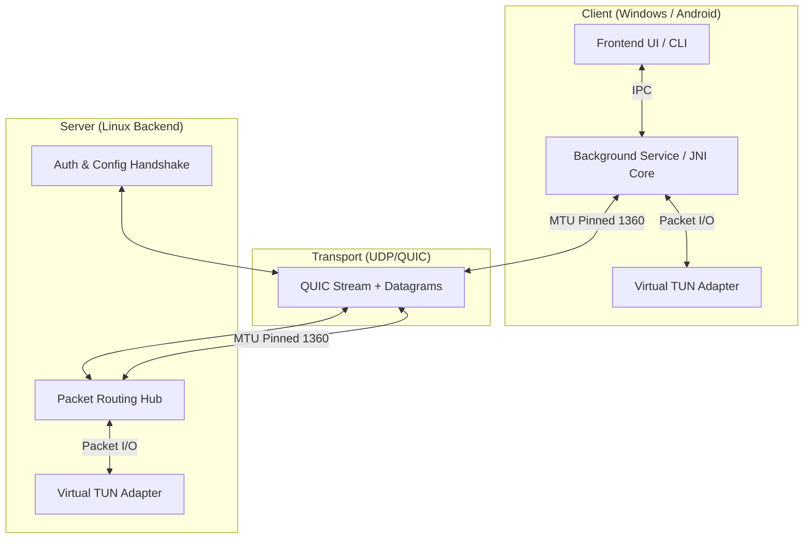

# Mavi VPN

Mavi VPN is a high-performance, censorship-resistant, modern VPN solution built with Rust and Kotlin. It leverages the QUIC protocol (via `quinn`) to provide secure, reliable, and low-latency connectivity over UDP, designed specifically for unstable mobile networks.

## Architecture Overview

## Key Features

*   **Censorship Resistance**:
    *   **Layer 7 Obfuscation**: Camouflages VPN traffic as standard HTTP/3 traffic using ALPN `h3`.
    *   **Probe Resistance**: Actively detects unauthorized probes and responds with a fake `nginx` welcome page (HTTP/3 200 OK) to blend in.
*   **High Performance**:
    *   **Zero-Copy Path**: Uses `bytes` and `BytesMut` for zero-copy packet handling across the entire stack.
    *   **Batched I/O**: Reduces syscall overhead by batching TUN device writes.
    *   **BBR Congestion Control**: Optimized for high-bandwidth, high-latency mobile networks.
*   **Mobile-First Resilience**:
    *   **Seamless Roaming**: Automatic connection migration (IP-address change) without handshake restarts.
    *   **MTU Pinning (1280/1360)**: Avoids "Path MTU Black Holes" by enforcing a stable 1280 payload size.
*   **Windows & Android Support**: Native high-performance clients for both platforms.

## Project Structure

*   **`backend/`**: Linux VPN server. Manages the IP pool, handle QUIC sessions, and routing.
*   **`windows/`**: Refactored Windows client using a Service/Client architecture with `WinTUN`.
*   **`android/`**: Native Android app with a Rust JNI core.
*   **`shared/`**: Common protocol definitions and ICMP PTB signal generation.

## Getting Started

### Server Deployment (Docker)
1. Navigate to `backend/`.
2. Configure `.env` (set `VPN_AUTH_TOKEN` and `VPN_NETWORK`).
3. Run `docker-compose up -d --build`.

### Windows Client
1. Build the service and client via Cargo in the `windows/` directory.
2. The service handles the privileged WinTUN adapter, while the user client communicates via local IPC.

### Android Client
1. Open the `android/` directory in Android Studio.
2. Build and deploy. Certificate pinning is recommended for production.

## Technical Documentation
For detailed implementation details, see the inline comments in:
- `backend/src/main.rs`: Packet hub and QUIC server logic.
- `windows/src/vpn_core.rs`: Windows network integration and WinTUN management.
- `shared/src/icmp.rs`: RFC-compliant MTU signal generation.

## License
MIT
