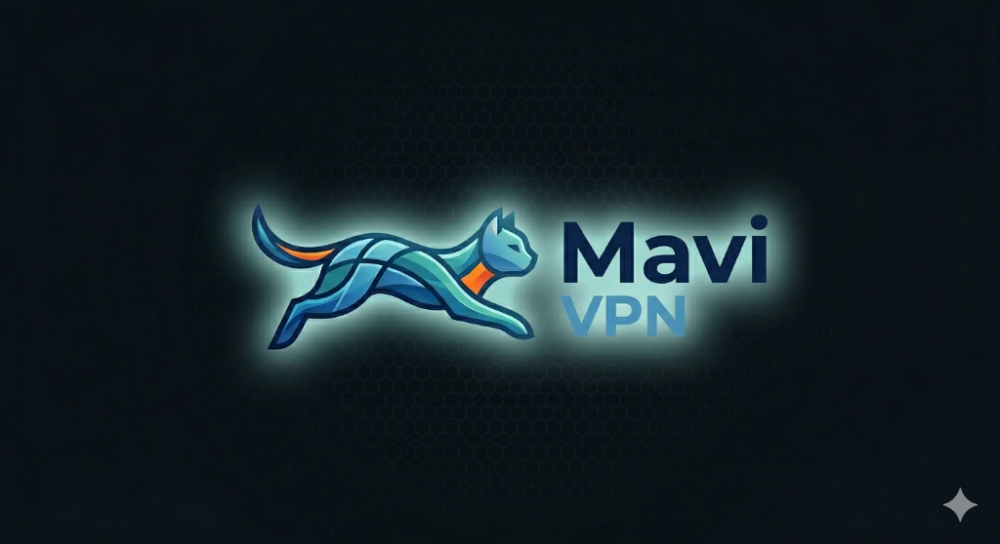
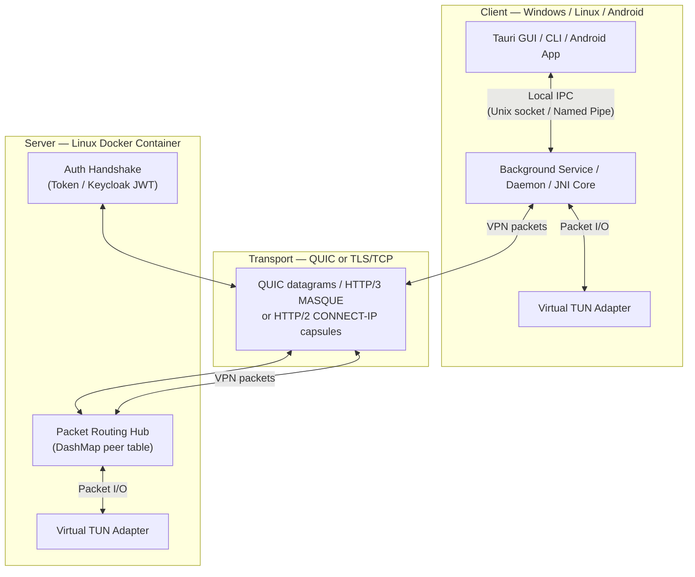

<p align="center">
  
</p>

<h1 align="center">Mavi VPN</h1>

<p align="center">
  <strong>Self-hosted VPN over QUIC, HTTP/3, or HTTP/2, built with Rust</strong>
</p>

<p align="center">
  <a href="#quick-start"></a>
  <a href="https://github.com/zerox80/mavi-vpn/releases/latest"></a>
  <a href="https://github.com/zerox80/mavi-vpn/actions"></a>
  <a href="https://github.com/zerox80/mavi-vpn/actions"></a>
  <a href="LICENSE"></a>
  
</p>


---
**[Mavi VPN 1.0.2 is available](https://github.com/zerox80/mavi-vpn/releases/tag/1.0.2).**

> Mavi VPN has not been independently security-audited. Do not rely on it for high-risk security use cases.

Mavi VPN tunnels IP traffic through your own Linux server. It uses **QUIC** by
default, with optional **HTTP/3 MASQUE** framing and an **HTTP/2 CONNECT-IP**
transport over TLS/TCP for networks where UDP is unavailable. You select the
transport in the client; HTTP/2 is not an automatic fallback.

Clients are available for **Windows**, **Linux**, and **Android**, with a
**Tauri desktop GUI** for Windows and Linux. Authentication uses a static token
or an existing Keycloak server.

For a server without a local Rust build, start with
**[mavi-vpn-docker](https://github.com/zerox80/mavi-vpn-docker)**: prebuilt Linux
AMD64 and ARM64 images with Docker Compose. Client downloads are on the
[releases page](https://github.com/zerox80/mavi-vpn/releases). Check the Assets
section for your chosen version; if a platform archive is not attached yet,
use the source build instructions below.

## Key Features

| Category | Feature | Details |
|---|---|---|
| **Censorship Resistance** | Layer 7 Obfuscation | VPN traffic can masquerade as **HTTP/3** via ALPN `h3` |
| | Probe Resistance | Unauthorized connections receive a fake **nginx** welcome page (H3 200 OK) |
| | MASQUE / RFC 9484 | Optional HTTP/3 `connect-ip` framing; resistance to filtering depends on the network |
| | HTTP/2 CONNECT-IP | Optional TLS/TCP transport using Extended CONNECT and RFC 9297 capsules |
| | TLS ClientHello Camouflage | Desktop **ECH GREASE** (RFC 9849) via HPKE (RFC 9180); Android cover SNI |
| | Certificate Pinning | SHA-256 cert fingerprint verification on all clients |
| **Performance** | Packet Buffers | `bytes`/`BytesMut` reduce copying in the packet pipeline |
| | BBR Congestion Control | BBR configured for QUIC transport |
| | GSO/GRO | Generic Segmentation Offload to reduce syscall overhead |
| | UDP Buffers | Requests 4 MiB socket buffers; effective sizes depend on OS limits |
| **Mobile-First** | Network Changes | QUIC connection migration and client reconnect handling |
| | MTU Coupling (1280..1360) | QUIC payload is derived as TUN MTU + 80; ICMP PTB generation (RFC 4443) |
| | Split Tunneling | Per-app VPN bypass on Android |
| **Auth** | Static Token | Simple pre-shared key authentication |
| | Keycloak OIDC | Enterprise SSO with JWT validation, PKCE, and JWKS rotation |
| **Network** | Dual-Stack | Full IPv4 + IPv6 support (NAT66 via ip6tables) |
| | DNS Isolation | NRPT rules on Windows; per-tunnel DNS on Linux/Android |

## Quick Start

### Server Deployment (Prebuilt Docker Images)

Use [mavi-vpn-docker](https://github.com/zerox80/mavi-vpn-docker#installation)
for the Compose file and setup steps. It runs the VPN server on Linux AMD64 or
ARM64 without installing Rust or compiling on the host. You need Docker Compose,
`/dev/net/tun`, host IP forwarding, and the configured port open in both host and
provider firewalls. The setup guide covers these requirements and client pairing.

The Docker repository defaults to IPv4-only. **The Windows client in 1.0.1 and
current `main` requires a complete IPv6 tunnel configuration**: follow the Docker
repository's [IPv6 setup](https://github.com/zerox80/mavi-vpn-docker#enabling-ipv6)
and set `VPN_DISABLE_IPV6=false` before connecting those clients.

Images are built from `main`; `latest` is not a versioned release image. See the Docker
repository's [update and rollback instructions](https://github.com/zerox80/mavi-vpn-docker#updates-and-rollbacks).

### Server Deployment (Build from Source)

Use this repository to build the server locally or run the optional
Keycloak/Traefik stack:

```bash
git clone https://github.com/zerox80/mavi-vpn.git
cd mavi-vpn/backend
cp .env.example .env
chmod 600 .env
openssl rand -hex 32         # Copy this value into VPN_AUTH_TOKEN in .env
nano .env                   # Set the token and check VPN_BIND_ADDR
```

Enable IPv4 forwarding on the host and persist it:

```bash
echo 'net.ipv4.ip_forward = 1' | sudo tee /etc/sysctl.d/99-mavi-vpn-ipv4.conf
sudo sysctl -p /etc/sysctl.d/99-mavi-vpn-ipv4.conf
```

For IPv6, complete the [host setup below](#ipv6-on-aws-lightsail--other-ra-based-hosts)
before starting the server. To run IPv4-only, set `VPN_DISABLE_IPV6=true`;
the current Windows client on `main` requires IPv6. This repository's
`.env.example` enables CR mode, so select the matching mode in the client.

```bash
docker compose up -d --build
docker compose logs --tail=100 vpn-server
```

Once the server has started, retrieve the certificate pin:

```bash
sudo cat data/cert_pin.txt
```

Enter the server address, port, token, and certificate pin in the client.
Back up `data/` before upgrades to preserve the certificates and keys.

> **Ports:** The Compose default is UDP `10443` for QUIC. If HTTP/2 is enabled,
> also allow the TCP port configured by `VPN_HTTP2_BIND_ADDR` (it may use the
> same numeric port as the QUIC listener).

The Dockerfile builds with `--locked`; rebuilding without a cache does not
refresh Git dependencies. To update the fork commits explicitly, run from the
repository root, then rebuild the server:

```bash
cargo update -p quinn -p quinn-proto -p quinn-udp -p h3 -p h3-quinn -p h3-datagram -p h2
```

### Windows Client

Download and extract the Windows archive from
[Releases](https://github.com/zerox80/mavi-vpn/releases), then run the
included MSI or NSIS installer as administrator. The installer includes the
GUI, CLI, and background service. For a CLI-only installation, keep the extracted
CLI and service binaries in an administrator-controlled installation directory,
then run there as administrator:

```powershell
.\mavi-vpn-service.exe install
net start MaviVPNService
```

Run the CLI from its installed or extracted directory:

```powershell
.\mavi-vpn-client.exe start     # Prompts for config on first run
.\mavi-vpn-client.exe stop
.\mavi-vpn-client.exe status
```

For source builds, see [windows/README.md](windows/README.md). The
[`build_windows_msi.py`](build_windows_msi.py) helper builds and packages the
Windows GUI, CLI, and service together.

### Linux Client

From a checkout of this repository, choose one source installer:

```bash
python3 install_cli_linux.py       # Builds CLI + optional systemd service
# Or, for the desktop GUI and daemon integration:
python3 install_gui_linux.py       # Builds GUI and bundled CLI (DEB/RPM)
```

The CLI and GUI installers create the `mavivpn` group and add your desktop user so the GUI/CLI can control the root daemon after you log out and back in. DEB/RPM packages also create this group and add the invoking `sudo` user when available. When installing through a graphical package manager or directly as root, explicitly grant a trusted user access with `sudo usermod -aG mavivpn USER`, then log out and back in.

With the systemd service installed:

```bash
sudo systemctl start mavi-vpn
mavi-vpn start                     # Connect via daemon
mavi-vpn stop                      # Disconnect
mavi-vpn status                    # Check VPN status
```

For a direct connection without the daemon, run `sudo mavi-vpn` instead.

### Android Client

Download and extract the Android archive from
[Releases](https://github.com/zerox80/mavi-vpn/releases), then install the
APK on Android 8.0 or newer. The current CI build is a **debug APK**. Updating
in place requires the same signing certificate; a different signing key can
require reinstalling the app and re-entering its configuration.

To build from source:

1. Install **Rust** targets + `cargo-ndk`:
   ```bash
   cargo install cargo-ndk
   rustup target add aarch64-linux-android armv7-linux-androideabi i686-linux-android x86_64-linux-android
   ```
2. Open the `android/` folder in **Android Studio**.
3. Build the APK; Gradle compiles the Rust core automatically. From `android/`,
   `./gradlew assembleDebug` runs the same debug build used in CI.

### Tauri GUI Development

Install the platform's build dependencies and VPN service first; the GUI uses
that service to manage connections. From the repository root:

```bash
cd gui
npm ci
npm run tauri -- dev
```

For distributable packages, use the platform helpers above. They build the
bundled CLI/service and prepare the installer resources before packaging.

## Architecture


```mermaid
graph TD
    subgraph "Client — Windows / Linux / Android"
        GUI["Tauri GUI / CLI / Android App"]
        SVC["Background Service / Daemon / JNI Core"]
        TUN_C["Virtual TUN Adapter"]

        GUI <-->|"Local IPC\n(Unix socket / Named Pipe)"| SVC
        SVC <-->|"Packet I/O"| TUN_C
    end

    subgraph "Transport — QUIC or TLS/TCP"
        QUIC["QUIC datagrams / HTTP/3 MASQUE\nor HTTP/2 CONNECT-IP capsules"]
    end

    subgraph "Server — Linux Docker Container"
        AUTH["Auth Handshake\n(Token / Keycloak JWT)"]
        HUB["Packet Routing Hub\n(DashMap peer table)"]
        TUN_S["Virtual TUN Adapter"]

        AUTH <--> QUIC
        HUB <--> QUIC
        HUB <-->|"Packet I/O"| TUN_S
    end

    SVC <-->|"VPN packets"| QUIC
    QUIC <-->|"VPN packets"| HUB
```

## Project Structure

```
mavi-vpn/
├── backend/            # Linux VPN server (Rust) — QUIC endpoint, IP pool, routing, Keycloak
│   ├── src/
│   │   ├── main.rs           # Entry point, connection accept loop
│   │   ├── config/            # CLI/env config (clap)
│   │   ├── state/             # AppState: IP pool (v4+v6), peer DashMap
│   │   ├── routing.rs        # TUN reader/writer tasks with local peer cache
│   │   ├── cert.rs           # TLS cert generation & SHA-256 PIN export
│   │   ├── ech.rs            # ECH key generation & ECHConfigList persistence
│   │   ├── keycloak.rs       # OIDC JWT validator with JWKS refresh
│   │   ├── handlers/         # Per-connection QUIC/HTTP2 session handlers
│   │   ├── network/          # TUN device creation, h3-quinn adapter
│   │   └── server/           # QUIC and HTTP/2 listeners
│   ├── docker-compose.yml    # Full stack: VPN + optional Traefik + Keycloak
│   ├── entrypoint.sh         # iptables NAT, IPv6 forwarding, MSS clamping
│   └── .env.example          # All configuration variables documented
│
├── windows/            # Windows client (Rust) — WinTUN, Service/Client IPC
│   └── src/
│       ├── main.rs           # CLI client (start/stop/status)
│       ├── bin/service.rs    # Windows Service (WinTUN, routing, NRPT DNS)
│       ├── vpn_core/         # QUIC/HTTP2 tunnel logic, ECH, MASQUE framing
│       └── oauth.rs          # PKCE OAuth2 flow for Keycloak
│
├── linux/              # Linux client (Rust) — TUN via /dev/net/tun, systemd
│   └── src/
│       ├── main.rs           # CLI + daemon mode + IPC client
│       ├── vpn_core.rs       # QUIC/HTTP2 tunnel logic with network change detection
│       ├── daemon/           # Unix socket IPC server for GUI/CLI integration
│       ├── network.rs        # Route setup, DNS config, cleanup
│       └── tun.rs            # Raw TUN device via ioctl
│
├── android/            # Android app (Kotlin + Rust JNI)
│   └── app/src/main/
│       ├── java/             # Kotlin: Jetpack Compose UI, VpnService, NetworkCallback
│       └── rust/src/lib.rs   # JNI core: QUIC/HTTP2, cert pinning, migration
│
├── gui/                # Cross-platform Tauri v2 GUI (HTML/CSS/JS + Rust)
│   ├── src/                  # Frontend (vanilla HTML/CSS/JS)
│   └── src-tauri/            # Tauri backend (IPC bridge, system tray, WiX installer)
│
├── shared/             # Shared library (Rust)
│   └── src/
│       ├── lib.rs            # ControlMessage protocol (Auth → Config → Datagrams)
│       ├── icmp.rs           # ICMP "Packet Too Big" generation (RFC 792/4443)
│       ├── ipc/              # IPC protocol (SecureIpcRequest, Config, Response)
│       ├── masque.rs         # CONNECT-IP capsules, varints, datagram framing
│       └── hex.rs            # Hex encode/decode utilities
│
├── quic-tester/        # Checks the response to unauthenticated HTTP/3 probes
├── docs/               # INSTALLATION.md, NGINX_PROXY.md, whitepaper.tex
├── Dockerfile          # Multi-stage build (rust:1.97-slim → debian:trixie-slim)
└── .github/workflows/  # CI: build (Linux CLI, Android APK, Linux/Windows GUI), tests
```

## Censorship Resistance Modes

Mavi VPN offers several mutually exclusive transport modes:

| Level | Mode | Wire Format | Activate |
|---|---|---|---|
| **0** | Standard | Raw QUIC datagrams | Default |
| **1** | CR Mode | QUIC + ALPN `h3` + probe resistance | `VPN_CENSORSHIP_RESISTANT=true` |
| **2A** | HTTP/3 Framing | MASQUE connect-ip (RFC 9484) over QUIC | `http3_framing: true` |
| **2B** | HTTP/2 CONNECT-IP | TLS/TCP + ALPN `h2` + RFC 8441 Extended CONNECT + RFC 9297 capsules | `http2_framing: true` |
| **+** | ECH camouflage | Desktop ECH GREASE (RFC 9849) + cover SNI; HPKE is RFC 9180 | Provide `ech_config` hex |

HTTP/2 mode requires `VPN_HTTP2_BIND_ADDR=0.0.0.0:10443` (or another TCP port) on the server and the **HTTP/2 CONNECT-IP** option on the client. It is mutually exclusive with CR mode, HTTP/3 framing, and ECH. The server and clients exchange real HTTP/2 frames and CONNECT-IP capsules. Unlike the QUIC data plane, HTTP/2 capsules are reliable and ordered because they run over TLS/TCP; traffic volume and timing can still differ from ordinary browsing.

The HTTP/2 listener allows at most 100 connections awaiting TLS or VPN authentication,
within its overall 1,000-connection limit. TLS must complete within 10 seconds;
the first authenticated CONNECT-IP must then succeed within another 10 seconds.
HTTP requests and PINGs do not extend this deadline. Authenticated tunnels release
the pending-authentication slot and are not subject to this setup deadline.

When CR Mode is enabled, the server responds to unauthorized connections with a fabricated HTTP/3 nginx welcome page, improving resistance to simple active probes.

On Windows and Linux QUIC clients, an administrator-provided `ECHConfigList` configures rustls `EchMode::Grease` and a cover SNI. Android can use the config's `public_name` as its SNI but does not emit an ECH extension because its `ring` provider lacks HPKE. The server persists ECH config/key artifacts but does not currently decrypt an inner ClientHello, so this is camouflage and compatibility testing rather than full end-to-end ECH confidentiality. ECH is RFC 9849; its HPKE building block is RFC 9180. HTTP/2 mode does not use ECH.

## Authentication

### Static Token
Set `VPN_AUTH_TOKEN` on the server. Raw QUIC clients send it in the bincode
control handshake; HTTP/3 and HTTP/2 clients send it as `Authorization: Bearer
<token>` during CONNECT-IP setup.

### Keycloak OIDC (Enterprise)
Full enterprise SSO with Keycloak:

1. Enable in server `.env`:
   ```bash
   VPN_KEYCLOAK_ENABLED=true
   VPN_KEYCLOAK_URL=https://auth.example.com
   VPN_KEYCLOAK_REALM=mavi-vpn
   VPN_KEYCLOAK_CLIENT_ID=mavi-client
   ```
2. Add the Compose overlay and profiles to `backend/.env`:
   ```bash
   COMPOSE_FILE=docker-compose.yml:keycloak/docker-compose.yml
   COMPOSE_PROFILES=traefik,keycloak
   ```
   From `backend/`, run `docker compose up -d --build` to start the enabled services.
3. On first start, Keycloak **auto-imports** the `mavi-vpn` realm from `backend/keycloak/mavi-vpn-realm.json` — including the `mavi-client` public PKCE client, the `vpn-user` realm role, and token lifespans tuned for the VPN refresh cycle (10 min access token, 1 h SSO idle, 24 h SSO max). You only need to create your users in the Keycloak admin console; the realm and client setup is automated. See `docs/INSTALLATION.md` Step 4 for details.
4. Clients authenticate via **browser-based PKCE OAuth2** — the CLI/GUI opens a local HTTP server on port `18923`, redirects to Keycloak, and captures the JWT automatically.
5. Android release builds must use a verified HTTPS App Link redirect. Build with `-Pmavi.oauthRedirectUri=https://<verified-domain>/<callback-path>`, register that exact URI in Keycloak, and host `/.well-known/assetlinks.json` for the `com.mavi.vpn` package. Debug builds use `com.mavi.vpn://oauth/callback` by default.

> The server validates JWTs using Keycloak's JWKS endpoint with automatic key rotation and constant-time `azp` comparison.

## Performance Tuning

| Setting | Value | Why |
|---|---|---|
| Inner TUN MTU | **1280** | Default inner MTU; allowed range 1280–1360. QUIC needs additional outer packet space |
| QUIC Payload | **TUN MTU + 80** | Derived from the selected inner MTU; default is 1360 |
| Congestion Control | **BBR** | QUIC congestion controller; tune and measure for your network |
| UDP Socket Buffers | **4 MiB requested** | Helps absorb bursts; OS limits can cap the effective size |
| Allocator | **system default** | Avoids an unused native allocator dependency in test and build paths |
| Release Profile | `lto=true, codegen-units=1, strip=true` | Maximally optimized binary |

## Configuration Reference

Defaults below are for the server binary unless noted. `VPN_IPV6_WAIT` is a
Docker entrypoint setting. Compose and `.env` can override these defaults:
the source Compose setup uses port `10443`, while `mavi-vpn-docker` also defaults
to `VPN_DISABLE_IPV6=true`. In the source Compose file, environment variables must
be listed under the service's `environment` mapping to reach the container.

| Variable | Default | Description |
|---|---|---|
| `VPN_BIND_ADDR` | `0.0.0.0:4433` | QUIC listen address |
| `VPN_HTTP2_BIND_ADDR` | *(disabled)* | Optional TLS/TCP listener for HTTP/2 CONNECT-IP; may use the same numeric port as QUIC |
| `VPN_AUTH_TOKEN` | *(required unless Keycloak is enabled)* | Pre-shared authentication token |
| `VPN_NETWORK` | `10.8.0.0/24` | IPv4 client subnet (supports /8 to /30) |
| `VPN_NETWORK_V6` | `fd00::/64` | IPv6 client subnet (ULA) |
| `VPN_DISABLE_IPV6` | `false` | Skip all IPv6 setup and run IPv4-only |
| `VPN_IPV6_WAIT` | `30` | Seconds to wait for the WAN's global IPv6 to appear before continuing |
| `VPN_DNS` | `1.1.1.1` | DNS server pushed to clients |
| `VPN_DNS_V6` | *(automatic)* | IPv6 DNS server pushed when IPv6 is active |
| `VPN_MTU` | `1280` | TUN interface MTU |
| `VPN_CENSORSHIP_RESISTANT` | `false` | Enable Layer 7 obfuscation |
| `VPN_MSS_CLAMPING` | `false` | TCP MSS rewriting via iptables mangle; Compose defaults to `true`, but the source `.env.example` sets `false` |
| `VPN_ALLOW_CLIENT_TO_CLIENT` | `false` | Allow VPN clients to reach each other (blocked by default) |
| `VPN_TUN_DEVICE` | *(automatic; `mavi0` in Docker)* | Optional server TUN device name |
| `VPN_WHITELIST_DOMAINS` | *(empty)* | Comma-separated client-side split-tunnel domain allow-list |
| `VPN_CERT` | `data/cert.pem` | TLS certificate path |
| `VPN_KEY` | `data/key.pem` | TLS private key path |
| `VPN_ECH_PUBLIC_NAME` | `cloudflare-ech.com` | ECH cover SNI domain |
| `VPN_ECH_CONFIG` | `data/ech_config.bin` | Persisted ECHConfigList path |
| `VPN_ECH_KEY` | `data/ech_key.bin` | Persisted ECH private key path |
| `VPN_KEYCLOAK_ENABLED` | `false` | Enable Keycloak JWT auth |
| `VPN_KEYCLOAK_URL` | — | Keycloak server URL (must be `https://`; plain HTTP only for localhost) |
| `VPN_KEYCLOAK_REALM` | `mavi-vpn` | Keycloak realm name |
| `VPN_KEYCLOAK_CLIENT_ID` | `mavi-client` | Keycloak OIDC client ID |
| `VPN_KEYCLOAK_REQUIRED_ROLE` | — | Optional fail-closed: accepted JWTs must carry this realm/client role |
| `VPN_KEYCLOAK_REQUIRED_SCOPE` | — | Optional fail-closed: accepted JWTs must carry this OAuth scope |

> **Token lifetimes:** The auto-imported realm pre-configures Access Token Lifespan = 10 min, SSO Session Idle = 1 h, SSO Session Max = 24 h — matching the client's 300 s refresh skew to avoid mid-session disconnects. For existing deployments or to customize, see `docs/INSTALLATION.md` Step 4.

## Testing

Source builds require Rust 1.95 or newer. The [`quinn`](https://github.com/zerox80/quinn)
and [`h3`](https://github.com/zerox80/h3) forks track `main`; [`h2`](https://github.com/zerox80/h2)
tracks `master`. The [fork update workflow](.github/workflows/update-forks.yml)
refreshes their lockfile revisions daily after Linux and Windows build checks.

```bash
# Run the portable Rust core without Tauri/WebView or OS service deps
cargo test-core-workspace --verbose

# Focused core checks
cargo test -p shared --verbose
cargo test -p mavi-vpn --verbose
```

For the Tauri backend, install WebView/Tauri dependencies and build the frontend
assets before running its tests:

```bash
cd gui
npm ci
npm run build
cd ..
cargo test-gui-backend --verbose
```

The `quic-tester/` tool checks the server's response to an unauthenticated HTTP/3
probe. A successful response confirms that behavior, not resistance to every DPI system:
```bash
cargo run -p quic-tester -- 127.0.0.1:10443  # Replace with your server's IP:port
# Expects HTTP/3 nginx response → confirms probe resistance is active
```

## Troubleshooting

### IPv6 on AWS Lightsail & other RA-based hosts

On AWS Lightsail (and similar clouds) the instance receives its public IPv6 address and default route via **Router Advertisements (RA)** on the WAN interface (e.g. `ens5`), and the public address is typically a single `/128`. Mavi VPN does **not** hand that public prefix to clients — clients get internal **ULA** addresses from `fd00::/64` and reach the internet through **NAT66**. For that to work:

- **Keep accepting Router Advertisements before enabling forwarding.** On RA-based hosts, set `accept_ra=2` on the WAN interface first so enabling forwarding does not drop the IPv6 default route:
  ```bash
  MAVI_WAN=$(ip -4 route get 1.1.1.1 | awk '{for (i=1; i<=NF; i++) if ($i=="dev") {print $(i+1); exit}}')
  sudo sysctl -w "net.ipv6.conf.${MAVI_WAN}.accept_ra=2"
  ```
- **Enable forwarding on the host.** The container uses `cap_drop: ALL` with `NET_ADMIN`, `NET_RAW`, and `NET_BIND_SERVICE` added back. Its `/proc/sys` is read-only, so it cannot configure host sysctls itself. Enable forwarding and persist both settings (see [`docs/INSTALLATION.md`](docs/INSTALLATION.md)):
  ```bash
  sudo sysctl -w net.ipv6.conf.all.forwarding=1
  ```

If the host has public IPv6 but forwarding is not enabled, the container now **fails loudly** at startup (instead of pretending IPv6 works) and prints the exact host commands to run. To run IPv4-only on purpose, set `VPN_DISABLE_IPV6=true`.

If IPv6 still fails, check using the `MAVI_WAN` interface identified above:
```bash
cat /proc/sys/net/ipv6/conf/all/forwarding        # expect: 1
cat "/proc/sys/net/ipv6/conf/${MAVI_WAN}/accept_ra" # expect: 2
ip -6 route show default                        # expect: default via fe80::… dev <wan> proto ra
sudo ip6tables -t nat -S MAVI_VPN6_NAT            # expect: MASQUERADE for fd00::/64 via <wan>
```

## Documentation

| Document | Description |
|---|---|
| [mavi-vpn-docker](https://github.com/zerox80/mavi-vpn-docker) | Prebuilt server images, Docker Compose setup, updates, and migration |
| [`docs/INSTALLATION.md`](docs/INSTALLATION.md) | Comprehensive installation guide for all platforms |
| [`docs/NGINX_PROXY.md`](docs/NGINX_PROXY.md) | Deploying behind an existing Nginx with wildcard SSL |
| [`CODEWIKI.md`](CODEWIKI.md) | Deep technical encyclopedia of the entire codebase |
| [`docs/whitepaper.tex`](docs/whitepaper.tex) | Academic whitepaper (LaTeX) |

## Roadmap

- [ ] **Socket Sharding** — `SO_REUSEPORT` for multi-core UDP scaling
- [ ] **eBPF Data Plane** — Kernel-level packet routing for zero-copy efficiency
- [ ] **iOS Support** — Rust core via C-FFI + `NEPacketTunnelProvider`
- [ ] **Server-side ECH** — Full ECH decryption when rustls adds support

## License

[MIT](LICENSE) — Copyright © 2026 [zerox80](https://github.com/zerox80)
